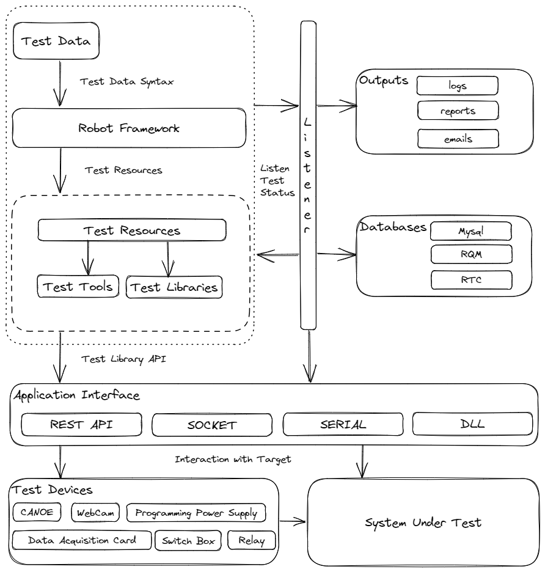
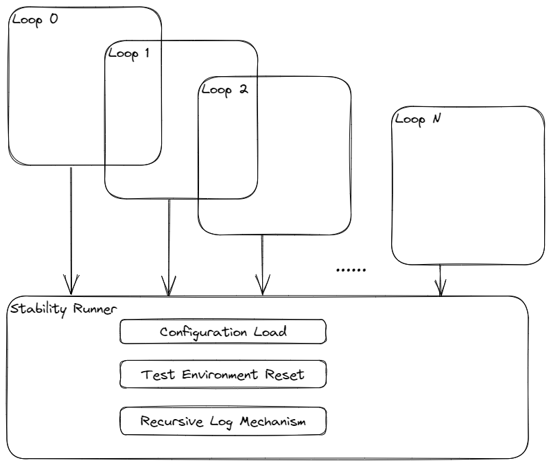

# Vite 测试自动化框架（VTA）

**English** | [简体中文](README.zh-cn.md)


[](https://github.com/psf/black)

## 功能

- ⚙️使用 [Black](https://black.readthedocs.io/en/stable/) 进行 Python 代码格式化
- 🤖使用 [Robot Framework](https://robotframework.org/) 运行测试用例
- 🤝使用 [SQLModel](https://sqlmodel.tiangolo.com/) [Engine](https://docs.sqlalchemy.org/en/20/core/engines.html#mysql) 与数据库交互
- 🌽异步运行关键字 [GeventLibrary](https://github.com/eldaduzman/robotframework-gevent)
- ⚡️极速 Python 代码检查工具 [Ruff](https://beta.ruff.rs/docs/)
- 📘 使用 Poetry 进行 Python 打包和依赖管理
- 📤提供 RQM API
- 📧通过 SMTP 服务器发送邮件
- 🏃‍♂️自动删除日志
- 🍉轻量级，不到 2MB

## 动机

1. 使用 RF 运行功能测试，其伪代码般的语法能够自动生成漂亮的报告。
2. 压力测试只需多次运行一个功能测试，无需额外工作。
3. 借助现成的日志工具易于调试，测试后易于解析或进行数据分析。
4. 测试用例兼容 RF 和 Python。
5. 硬件与框架分离，可通过 API 调用。
6. 邮件和 RQM API 结构良好，专注于提高效率。
7. 使用内置模块，尽可能保持轻量级。
8. 从 Robot 中删除数据库和数据统计，让用户专注于测试。

## 先决条件

- python >= 3.9

## 快速开始

1. 克隆项目

    ```sh
    git clone https://github.com/maple24/vta.git
    ```

2. 安装依赖

    ```sh
    poetry install
    ```

3. （可选）激活虚拟环境

    ```sh
    poetry shell
    ```

4. （可选）在不激活虚拟环境的情况下运行脚本

   ```sh
    poetry run <script>
   ```

5. （可选）为 robotframework 设置您的 pythonpath

    ```sh
    转到 Robot Framework Language Server 扩展并转到扩展设置
    在那里你会找到: Robot > Language-server: Python
    ```

6. 格式化您的代码

    ```sh
    poetry run format
    ```

## 架构

1. 功能测试构建模块

2. 稳定性测试构建模块


- Helpers: 纯函数/类/API，位于独立文件中，无需相对导入
- Managers: 使用 Helpers 构建的高级函数

## 贡献

1. Fork 项目（<https://github.com/maple24/vta.git>）
2. 创建你的特性分支（git checkout -b my-new-feature）
3. 提交你的更改（git commit -am 'Add some feature'）
4. 推送分支（git push origin my-new-feature）
5. 创建一个新的 Pull Request

## 许可证

[](https://opensource.org/licenses/Apache-2.0)
